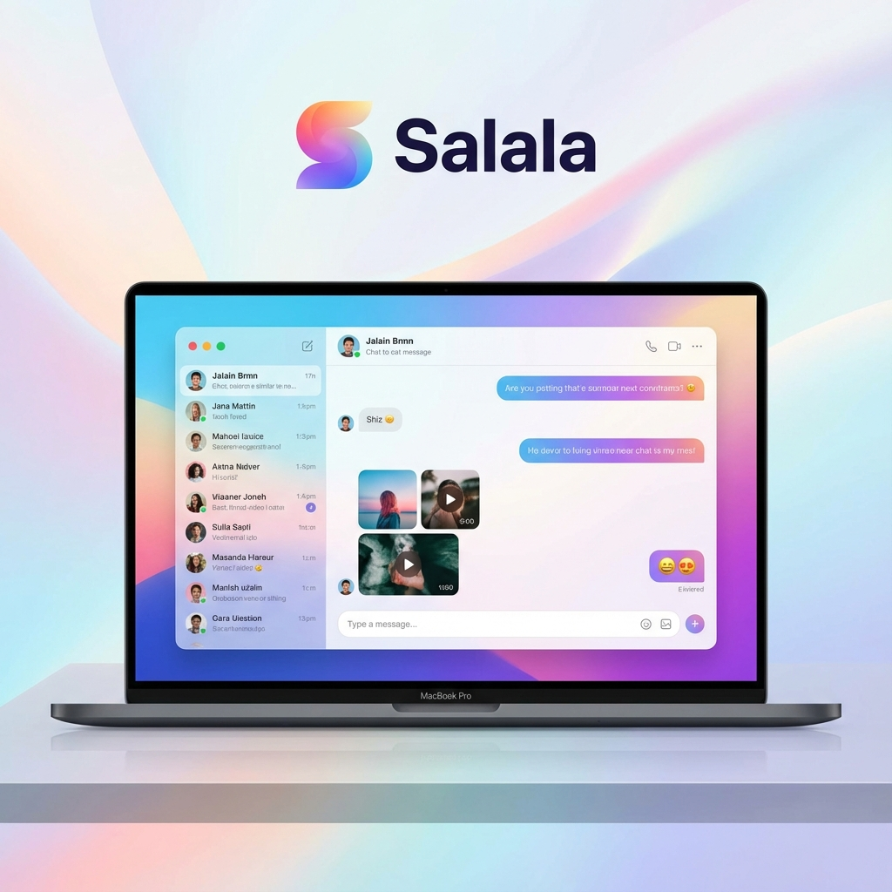
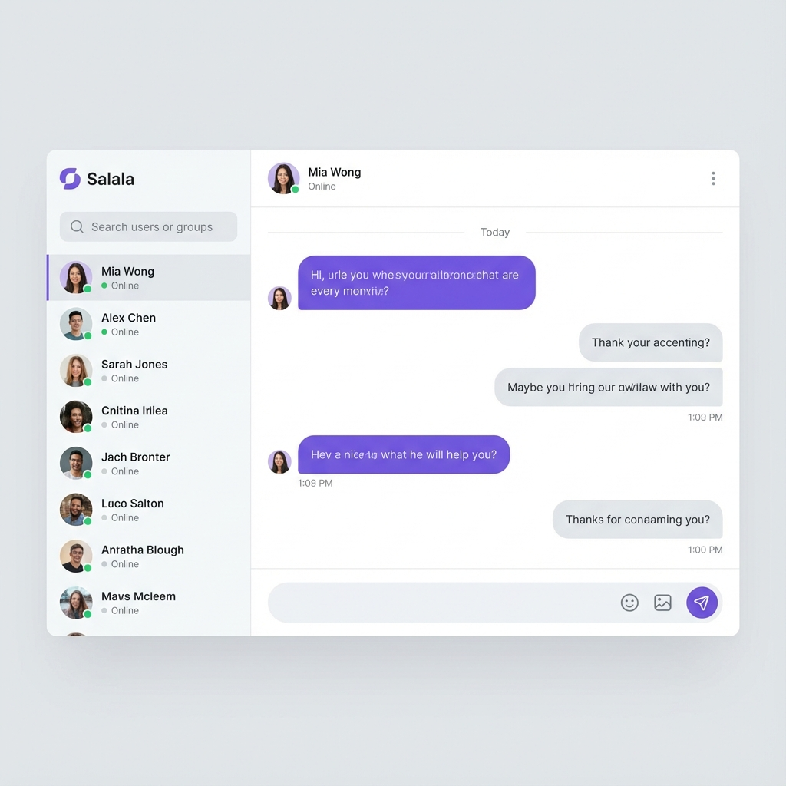
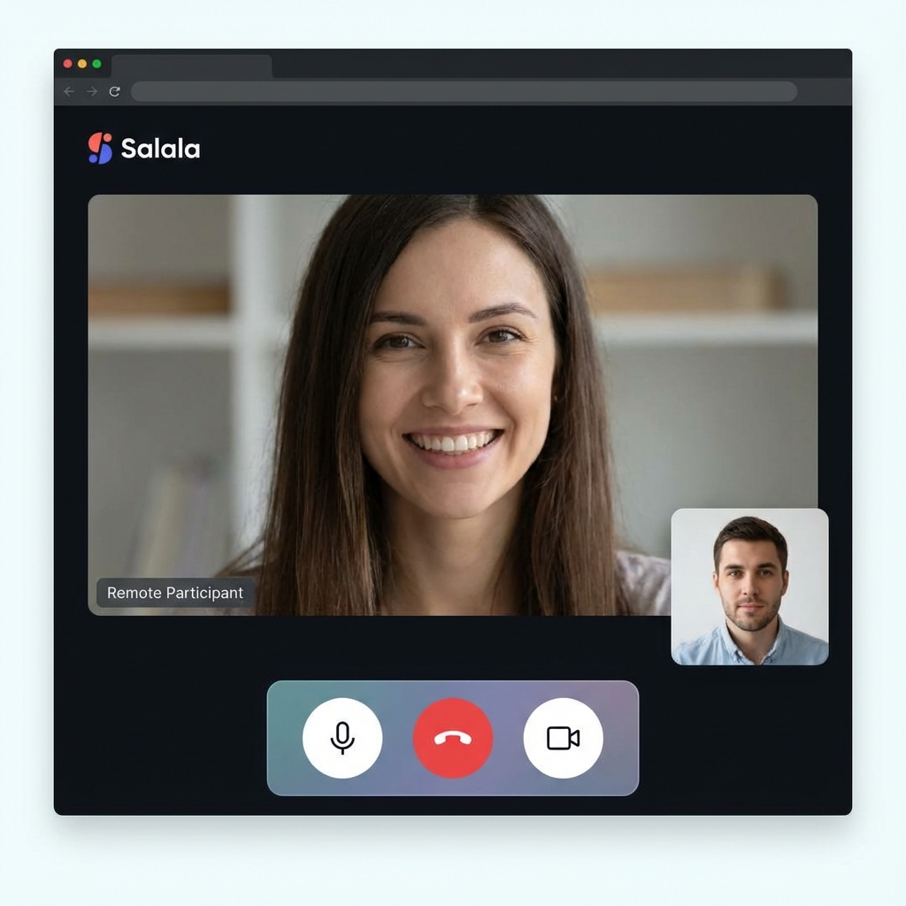
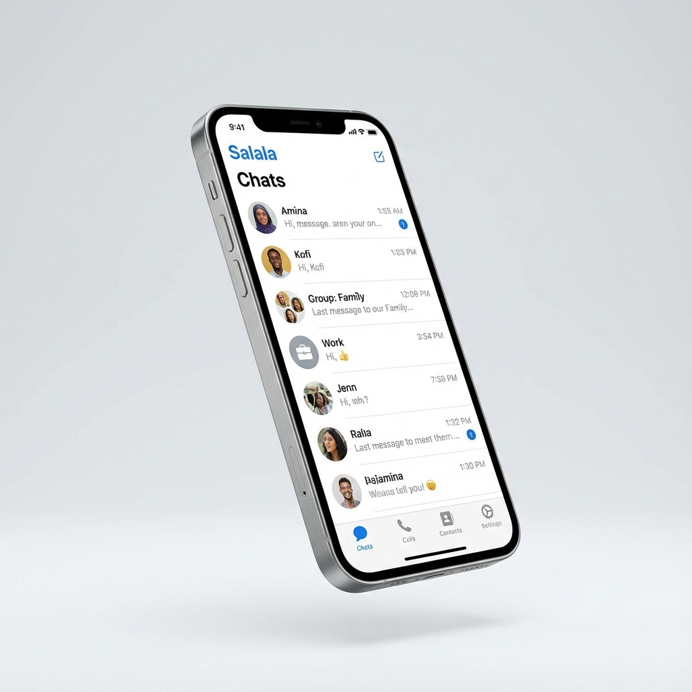
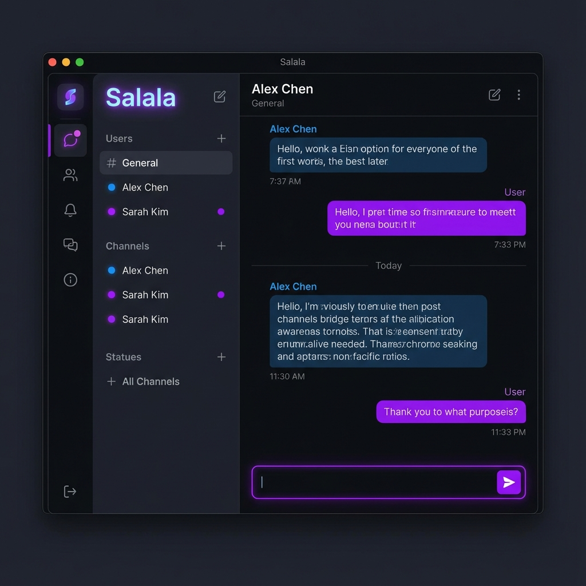
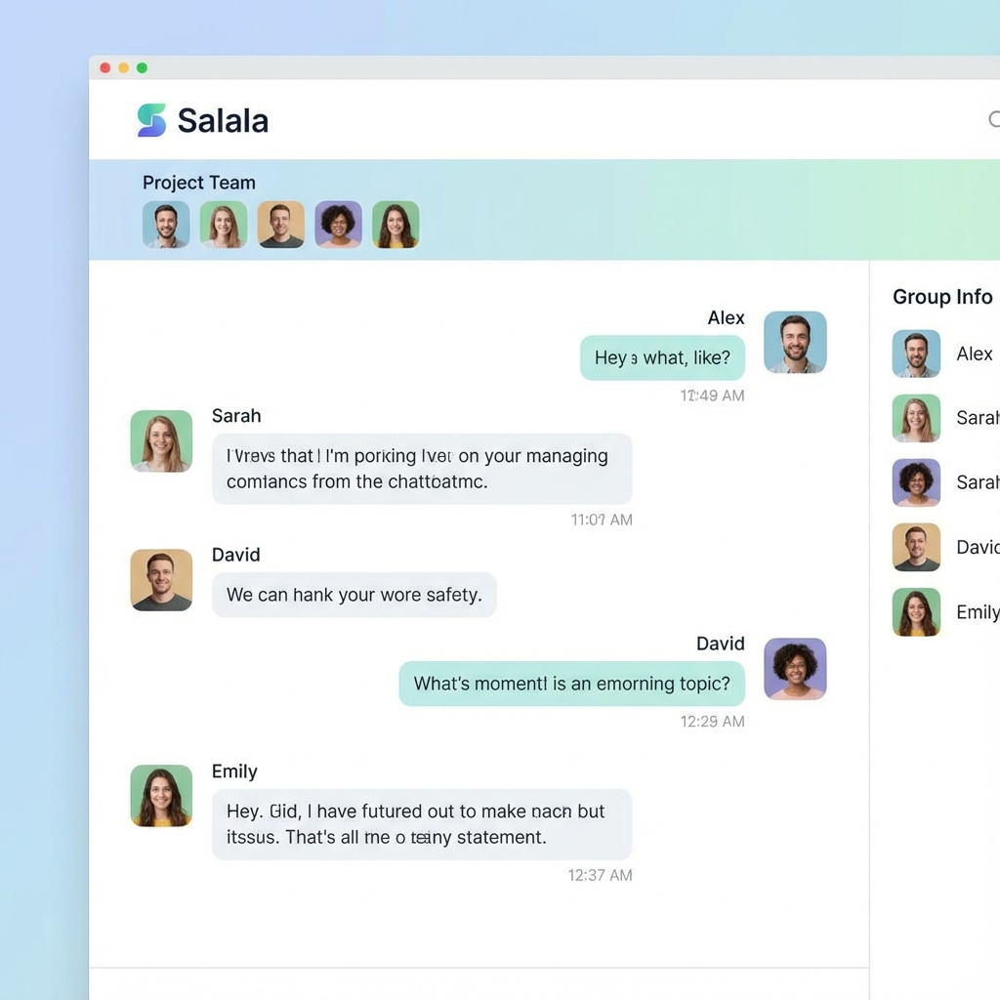

# Salala - Real-time Chat Application

A full-featured real-time chat application with video/audio calling capabilities, built with modern web technologies.



## Features

### Core Messaging
- **Real-time Messaging** - Instant message delivery using WebSocket (Socket.io)
- **1-on-1 Chats** - Private conversations between two users
- **Group Chats** - Create group conversations with multiple participants
- **Message History** - Infinite scroll to load older messages
- **File & Image Sharing** - Upload and share images with Cloudinary integration
- **Emoji Picker** - Express yourself with a rich emoji selection

### Communication
- **WebRTC Video Calls** - High-quality peer-to-peer video calling
- **WebRTC Audio Calls** - Voice calls with mute/unmute controls
- **Call UI** - Full-screen and picture-in-picture call views
- **Typing Indicators** - See when others are typing in real-time
- **Read Receipts** - Know when your messages have been read

### Social Features
- **Friend System** - Send and accept friend requests
- **User Profiles** - View and edit user profile information
- **Online Status** - See who's online or offline
- **Push Notifications** - Get notified of new messages (Firebase FCM)

### User Experience
- **Dark/Light Theme** - Toggle between dark and light modes
- **Internationalization (i18n)** - Multi-language support
- **Mobile Responsive** - Dedicated mobile navigation and views
- **Unread Badges** - Visual indicators for unread messages
- **Dynamic Page Titles** - See unread count in browser tab

### Security & Performance
- **JWT Authentication** - Secure token-based authentication
- **API Rate Limiting** - Protection against abuse
- **Password Hashing** - Secure password storage with bcrypt

## Screenshots

| Chat Interface | Video Call | Mobile View |
|:---:|:---:|:---:|
|  |  |  |

| Dark Mode | Group Chat | Profile |
|:---:|:---:|:---:|
|  |  |  |

## Tech Stack

### Frontend
| Technology | Purpose |
|------------|---------|
| Next.js 16 | React framework with App Router |
| React 19 | UI library |
| TailwindCSS 4 | Utility-first CSS framework |
| Zustand | State management |
| TanStack Query | Data fetching & caching |
| Socket.io Client | Real-time WebSocket communication |
| WebRTC | Peer-to-peer video/audio calls |
| Radix UI | Accessible UI components |
| Lucide Icons | Icon library |
| i18next | Internationalization |
| Firebase | Push notifications |

### Backend
| Technology | Purpose |
|------------|---------|
| NestJS 11 | Node.js framework |
| Prisma | Database ORM |
| MongoDB | NoSQL database |
| Redis | Caching & pub/sub |
| Socket.io | Real-time WebSocket server |
| JWT | Authentication |
| Cloudinary | Image/file storage |
| Firebase Admin | Push notification service |
| bcrypt | Password hashing |

### DevOps & Tooling
| Technology | Purpose |
|------------|---------|
| Docker | Containerization |
| pnpm | Package manager |
| Turborepo | Monorepo build system |
| TypeScript | Type safety |

## Project Structure

```
salala/
├── backend/              # NestJS API server
│   ├── src/
│   │   ├── auth/         # Authentication module
│   │   ├── chat/         # Chat gateway (WebSocket)
│   │   ├── social/       # Friends, conversations, users
│   │   ├── notification/ # Push notifications
│   │   ├── upload/       # File uploads
│   │   ├── prisma/       # Database service
│   │   └── redis/        # Redis service
│   └── prisma/
│       └── schema.prisma # Database schema
├── frontend/             # Next.js web application
│   └── src/
│       ├── app/          # App router pages
│       ├── components/   # React components
│       ├── hooks/        # Custom React hooks
│       ├── lib/          # Utilities
│       └── store/        # Zustand stores
├── packages/
│   └── shared/           # Shared TypeScript types
└── docker-compose.yml    # MongoDB & Redis services
```

## Getting Started

### Prerequisites

- **Node.js** v20 or higher
- **pnpm** package manager
- **Docker** & Docker Compose

### Installation

1. **Clone the repository**
   ```bash
   git clone <repository-url>
   cd salala
   ```

2. **Install dependencies**
   ```bash
   pnpm install
   ```

3. **Start infrastructure services**
   ```bash
   docker-compose up -d
   ```

4. **Initialize MongoDB replica set** (required for Prisma transactions)
   ```bash
   docker exec -it salala-mongodb-1 mongosh --eval "rs.initiate()"
   ```

5. **Configure environment variables**

   Create `.env` file in `backend/`:
   ```env
   DATABASE_URL="mongodb://localhost:27017/chatapp?replicaSet=rs0"
   JWT_SECRET="your-secret-key"
   REDIS_URL="redis://localhost:6379"
   CLOUDINARY_URL="cloudinary://..."
   FIREBASE_SERVICE_ACCOUNT="..."
   ```

   Create `.env.local` file in `frontend/`:
   ```env
   NEXT_PUBLIC_API_URL="http://localhost:4000"
   NEXT_PUBLIC_SOCKET_URL="http://localhost:4000"
   NEXT_PUBLIC_FIREBASE_CONFIG="..."
   ```

6. **Generate Prisma client & push schema**
   ```bash
   cd backend
   npx prisma generate
   npx prisma db push
   ```

7. **Seed the database** (optional - for demo data)
   ```bash
   cd backend
   pnpm seed
   ```

### Development

Run both frontend and backend in development mode:

```bash
# From root directory
pnpm dev:backend   # Start NestJS server (port 4000)
pnpm dev:frontend  # Start Next.js app (port 3000)
```

Or use Turborepo to run everything:

```bash
turbo run dev
```

### Build for Production

```bash
pnpm build
```

## Environment Variables Reference

### Backend

| Variable | Description | Required |
|----------|-------------|----------|
| `DATABASE_URL` | MongoDB connection string with replica set | Yes |
| `JWT_SECRET` | Secret key for JWT tokens | Yes |
| `REDIS_URL` | Redis connection URL | Yes |
| `CLOUDINARY_URL` | Cloudinary API URL | Yes |
| `FIREBASE_SERVICE_ACCOUNT` | Firebase Admin SDK credentials | For push notifications |

### Frontend

| Variable | Description | Required |
|----------|-------------|----------|
| `NEXT_PUBLIC_API_URL` | Backend API URL | Yes |
| `NEXT_PUBLIC_SOCKET_URL` | WebSocket server URL | Yes |
| `NEXT_PUBLIC_FIREBASE_CONFIG` | Firebase client config | For push notifications |

## Docker Services

The `docker-compose.yml` provides:

- **MongoDB** - Primary database (port 27017)
- **Redis** - Caching and pub/sub (port 6379)

```bash
# Start services
docker-compose up -d

# Stop services
docker-compose down

# View logs
docker-compose logs -f
```

## License

This project is unlicensed for educational purposes.
